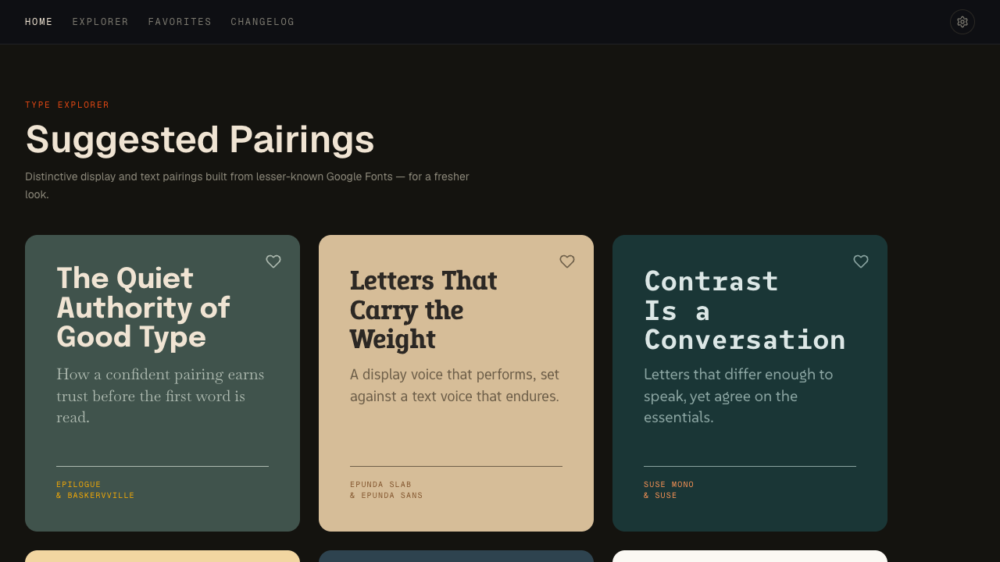
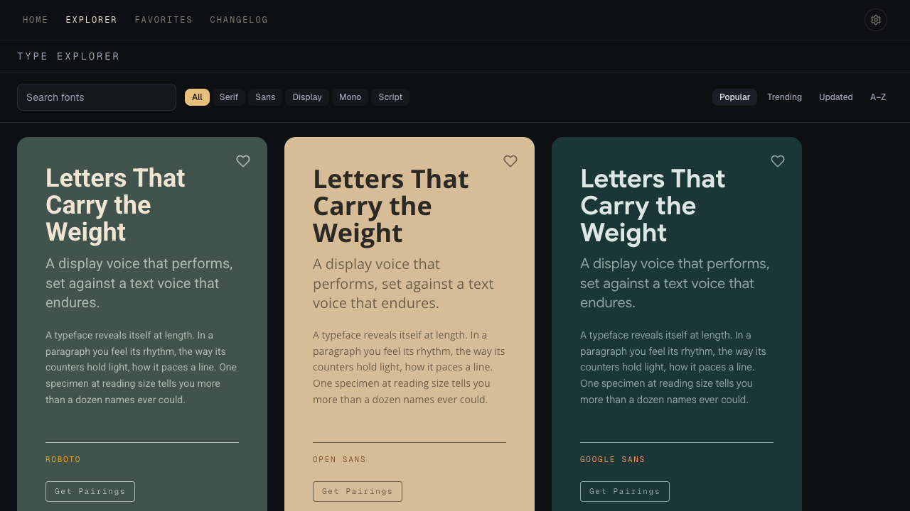
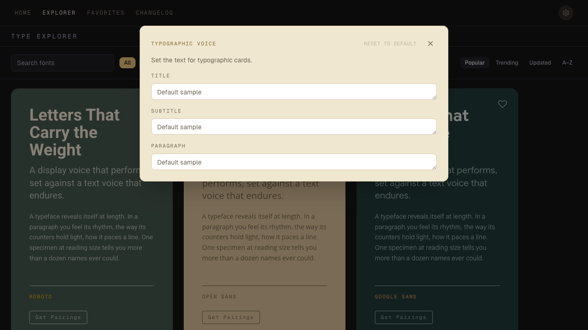
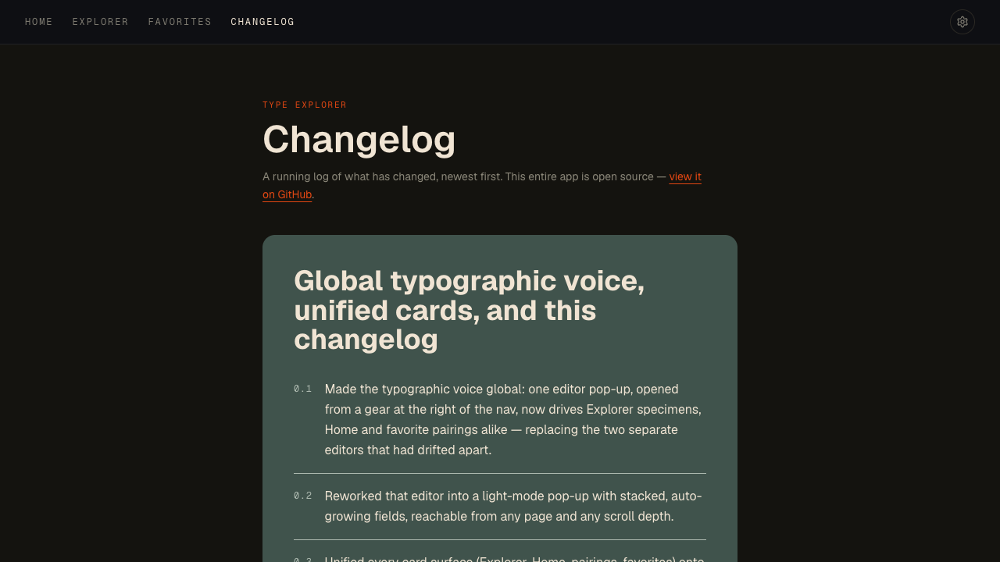

# Type Explorer

Browse Google Fonts as full-size specimens and discover display + text pairings —
both hand-curated and algorithmically suggested. A calmer way to choose type than
scrolling a wall of font names.

**And a site an AI agent can actually use** — not scrape, *use*. See
[Agent Ready](#agent-ready) below; it's the part of this repo worth stealing.

**Live:** [type-explorer-pi.vercel.app](https://type-explorer-pi.vercel.app/)

> **Status:** a personal project, shared publicly as a work sample. Issues and pull
> requests are welcome, but I make no promises about response time or whether
> anything gets merged — treat it as a conversation, not a support channel. You're
> also welcome to fork it and make it your own (see [Licensing](#licensing)).



## Agent Ready

Most software treats an AI agent as a degraded browser — something that scrapes a
page built for eyes and guesses. This project inverts that: **the agent is a
first-class user**, with its own contract, its own query surface, and its own
rendering target.

Tell an agent about this site. With nothing but the ability to fetch a page and
emit text — no install, no key, no account, no MCP server — it can:

1. **Discover** the whole contract in one fetch — [`/llms.txt`](public/llms.txt)
   indexes [`/agent.md`](public/agent.md), which is self-contained.
2. **Query** 1,900+ families *by feel* (`calm`, `competent`, `vintage`), plus the
   pairing library and the palettes, as JSON.
3. **Compose** a curated page for you by writing a URL by hand:

   ```
   /compose?pairs=space-grotesk+ibm-plex-mono,archivo+pt-serif
           &theme=bg:D4DCE2,fg:1E262B,accent:36596C,subtitle:A32B25
           &page=bg:000000
   ```

4. **Verify** it by fetching that URL back and reading one element.
5. **Hand off** the CSS to implement it — imports, Tailwind tokens, weights,
   fallbacks.

### The three ideas doing the work

**Assume the least-capable agent.** It can fetch a page and emit a URL for you to
click. No shell, no code execution, no browser, no screenshot loop. It might be
Claude Code; it's just as likely a chat client helping a non-developer. That single
assumption rules out compressed or base64 payloads — the agent has to hand-write
the URL, token by token, and get it right — which is why every parameter is plain
readable text.

**Craft lives in the site, not the agent.** Because the agent usually can't see its
own output, it must not be the thing deciding visual outcomes. It supplies choices;
the site guarantees the result. Hard requirement: *no valid URL may produce an ugly
page.* Curated palettes, derived-and-contrast-checked colors, one template,
sensible defaults for everything omitted.

**Never fail — but always say what you did.** A bad font slug drops one card. A bad
hex derives that role instead. Over-long text truncates. Nothing blank-pages,
because a real person is about to click that link. Every degradation is recorded in
a machine-readable block the agent reads on fetch-back, so it self-corrects on the
next URL without ever having seen the page.

The corollary, applied in the opposite direction: `/api/*` responses return an
`ignored[]` array naming params they didn't recognize. A data query that silently
lies is poison; a rendering surface that refuses to render is worse than one that
renders a little less. Same instinct, opposite rule.

### How novel is this, honestly

The shape isn't new — QuickChart, Kroki and Vercel OG all render from URL params,
and their scars are inherited here (no persistence, no short links, no signed
params, a ~2K character budget because Slack mangles longer links). `llms.txt` is a
proposed standard almost nobody consumes.

What's less common is treating the agent as the *primary* user of a design tool and
following that through: a contract written for a reader who can't see, a render
surface that guarantees taste rather than delegating it, and a degradation channel
that exists solely so a blind caller can correct itself. Whether that's the right
way to build for agents is genuinely open. It's an exploration, and the design
reasoning is written down in [`docs/plans/agent-surface-v1.md`](docs/plans/agent-surface-v1.md)
so it can be argued with.


## What it does

- **Home** — a gallery of ready-made display + text pairings: a less-common
  "Suggested" set up top and the familiar "Popular" combinations grouped below.
  Favorite any card.
- **Explorer** — browse the full Google Fonts catalog as real specimens (title,
  subtitle, and paragraph set in the actual font), with search, category filters,
  and popularity / trending / recently-updated sort. Set a custom "typographic
  voice" to judge every font against the same words. Hit **Get Pairings** on any
  font to see curated and algorithmic partners in a modal.
- **Favorites** — everything you've collected, fonts and pairings, in one place.
- **Changelog** — a running, newest-first log of changes at `/changelog`.
- **`/compose`** — a page an agent composes for you from URL params, with a color
  key and paste-ready CSS. See [Agent Ready](#agent-ready).

Pairing suggestions are precomputed offline (see [Data & scripts](#data--scripts))
from Google Fonts' own semantic tags plus a curated set — so the app ships with a
rich pairing library and needs no AI or API keys at runtime.

## Screenshots

The Explorer — the full catalog as real specimens, with search, filters, and sort:



The typographic voice — one pop-up sets the title, subtitle, and paragraph applied
to every card, so fonts and pairings are judged against the same words:



The changelog at `/changelog` — one card per dated entry:



## Run it

```bash
pnpm install
pnpm dev        # http://localhost:3000
```

That's it — **no API keys or environment variables are required** to run or host
the app. It reads static data committed to the repo (`data/fonts.json`,
`content/pairing-library.json`, `content/suggested-pairings.json`).

## Deploy

Zero-config on any Next.js host. On [Vercel](https://vercel.com), import the repo
and deploy — no environment variables to set. The font catalog and pairing library
are static files bundled into the build, so there are no runtime secrets or
external API calls (fonts themselves load from the Google Fonts CDN in the
browser).

## Data & scripts

The app reads three committed data files. Two are regenerated by offline scripts
that talk to the Google Fonts API; you only run these to refresh the data, and
they never run as part of the app or the deploy.

| File | What it is | Refresh with |
|---|---|---|
| `data/fonts.json` | The font catalog (families, variable axes, popularity/trending order) | `pnpm catalog:refresh` |
| `content/pairing-library.json` | Per-font curated + algorithmic pairings (the "Get Pairings" data) | `pnpm pairings:build` |
| `content/suggested-pairings.json` | The home-page pairing gallery | hand-maintained |

The two refresh scripts need a **free** Google Fonts Developer API key:

```bash
cp .env.example .env.local        # add GOOGLE_FONTS_API_KEY
pnpm catalog:refresh              # rewrites data/fonts.json
pnpm pairings:build               # rewrites content/pairing-library.json
```

Get a key by enabling the **Web Fonts Developer API** in a Google Cloud project
and creating an API key. Commit the regenerated JSON when you're happy with it.

## How it works

- **Next.js (App Router)** with React 19 and Tailwind v4.
- `lib/catalog.ts` reads the static `data/fonts.json`; `app/api/fonts` filters,
  sorts, and paginates it for the Explorer.
- `lib/pairing-library.ts` lazy-loads the pairing JSON so it stays out of the main
  bundle.
- `lib/css2-url.ts` builds the fiddly Google Fonts `css2` URLs (axis ordering
  rules) and is unit-tested; `lib/font-loader.ts` injects the stylesheet on demand.
- Favorites and the typographic-voice overrides persist in `localStorage` — no
  backend, no accounts.

## Scripts

```bash
pnpm dev               # local dev server
pnpm build             # production build
pnpm start             # serve the production build
pnpm test              # unit tests (css2 URL construction)
pnpm lint              # eslint
pnpm catalog:refresh   # regenerate data/fonts.json (needs GOOGLE_FONTS_API_KEY)
pnpm pairings:build    # regenerate content/pairing-library.json
```

## Changelog

The `/changelog` page renders `content/changelog.json` — a plain, newest-first
JSON array of `{ date, title, changes[] }` entries. To record a change, add or
edit an entry:

```json
[
  {
    "date": "2026-06-16",
    "title": "Short headline",
    "changes": ["What's different, from a user's point of view."],
    "files": ["app/path/to/file.tsx — what lives here"]
  }
]
```

`files` is optional and lists the key files the entry touched — it surfaces as a
small reference on the card and doubles as orientation for anyone (or any agent)
returning to the repo. Editing the file by hand is all it takes — no build step
or dependency. If you work on this repo with Claude Code, the `/changes` slash
command (`.claude/commands/changes.md`) drafts an entry from the current diff and
recent commits and prepends it for you.

## Licensing

This project's code is released under the [MIT License](LICENSE) — fork it, modify
it, build on it freely; just keep the copyright notice.

Google Fonts are under the SIL Open Font License or Apache License. The app embeds
no font files — it references the Google Fonts CDN — so the project and anything
you build from it stays licensing-clean.

## Status

_Snapshot of where the project is. Overwrite freely — it's a snapshot, not a log._

**Last shipped**

- **Near-miss slugs resolve; the surface stopped asking agents to verify.** An
  evaluation run produced a good result but spent several sequential round-trips
  getting there — and the same agent, asked to hand-write a URL from the grammar,
  matched it in zero tool calls. The fix wasn't prose: its verification pass was a
  *rational* response to real risk, since "guessing is safe" covered params but not
  slugs, and `source-serif` silently dropped a card. `lib/font-match.ts` now
  resolves a guessed slug (normalization, missing version suffix, edit distance ≤ 2
  under a ratio guard) and names the substitution in the notes — while `helvetica`
  still resolves to nothing, because a matcher that always finds *something* turns a
  wrong guess into a silently wrong specimen. With the risk gone, one stance
  everywhere: fetch-back is a debugging tool, never a step. `agent.md` gained a
  front-loaded one-shot block. See friction #7 in `docs/agent-story.md`.
- **Per-card palettes (`themes=`)** — one `/compose` URL can now show three cards
  with three distinct color looks (a `;`-separated palette list, one per card,
  same grammar as `theme`). Parser-only change; the render layer already indexed a
  themes array per card. Plus a contract-clarity pass in `agent.md` (two-facets
  model, optional fetch-back, guess-and-degrade blessed) and `docs/agent-story.md`,
  the cold-agent run that drove it.
- **The one-fetch fix** — the whole construct-a-URL contract is now inlined into
  the home page's server-rendered HTML (and a short pointer sits on every other
  route). A plain chat agent given only the bare domain can now compose a working
  `/compose` link with zero further fetches; `/agent.md` + `/llms.txt` are
  enrichment, not the critical path. Fixes the failure where the "Agent Ready"
  badge promised a capability the first fetch didn't deliver.
- **Agent surface V1** — the site is now usable *by* agents, not just readable.
  All four phases of [`docs/plans/agent-surface-v1.md`](docs/plans/agent-surface-v1.md)
  are in: discovery (`/llms.txt`, `/agent.md`, `/robots.txt`, sitemap), an honest
  query surface (`ignored[]` + `?strict=1`, the `feeling` alias, `/api/palettes`,
  `/api/pairings`), the `/compose` render route, and the paste-ready handoff block.
- Visual category selector on Fonts, plus a grid breakpoint fix
- Pairing cards: paragraph support, always-on fonts, pivot to a partner

**How to see it**

```
/compose?pairs=space-grotesk+ibm-plex-mono,archivo+pt-serif&theme=bg:D4DCE2,fg:1E262B,accent:36596C,subtitle:A32B25&page=bg:000000
```

An agent writes that URL by hand, usually straight from memory, and hands it over
— no fetch back, nothing to check. `/api/fonts`, `/api/pairings` and
`/api/palettes` are there for the data an agent *can't* recall (feeling tags,
curated pairings, real axis ranges), not as a required first step. The page
reports what it did at `#agent-notes` and carries its implementation config at
`#agent-specs` — both visually hidden, both in the DOM so a fetch still returns
them. Malformed URLs degrade and explain themselves rather than failing, and a
half-remembered font slug resolves to the nearest real family, since the agent
writing the URL usually can't see the result.

**Open questions**

1. **The curated palettes aren't all WCAG AA.** `/api/palettes` computes real
   ratios, and several `muted` roles land at 3.2–4.1:1 (palette 9's `fg` is 3.55).
   Agent-supplied palettes *are* held to 4.5:1, so the site currently applies a
   stricter bar to strangers than to itself. `agent.md` states this plainly rather
   than papering over it. Retuning would change the existing look, so it needs a call.
2. **`contrast=5` can silently do nothing.** Many families cap below `wght 900`
   (Space Grotesk stops at 700), and asking past the ceiling renders identically
   with `data-status="ok"` and no note — the one failure mode the notes block
   exists to prevent. The axis range is right there in the catalog; a note is cheap.
3. **`SiteChrome` hides the nav via a pathname check**, not route groups. The clean
   Next pattern would relocate every route under a `(site)` group; not worth a
   mechanical change across ~1,900 pages for the same result, but it is a shortcut.
4. **`MAX_PAIRS` is 4.** Inherited from the plan's URL-budget reasoning, which is
   weaker than it looked — three cards with full copy is ~530 chars against a
   ~2,000 target. 6 is probably the better cap.

**Up next**

- A font key to match the color key: naming the faces and sizes the way the swatch
  row names colors, so revisions can come back as "bump the 36 to 44."
- MCP as a fast-follow — it reuses the Phase 2 JSON endpoints verbatim.
- Let the voice modal emit an updated `/compose` URL, closing the loop from the
  human's edit back to their agent.

Backlog of smaller ideas lives in [`BACKLOG.md`](BACKLOG.md) and on the
[/backlog](https://googlefontfinder.com/backlog) page.
